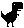
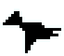

# 🦖 NEAT Dino Game

A Chrome dinosaur game clone with NEAT (NeuroEvolution of Augmenting Topologies) AI implementation.

<div align="center">
  
  <br>
  <em>Watch AI learn to play the classic Chrome dinosaur game!</em>
</div>

## 🎮 Overview

This project implements the classic Chrome dinosaur game with an AI that learns to play using the NEAT algorithm. The dinosaur learns to jump over cacti and duck under birds to achieve the highest score possible.

## ✨ Features

- 🦖 Classic dinosaur game mechanics (jump, duck, obstacles)
- 🧠 NEAT algorithm implementation for AI learning
- 📊 Visual representation of neural networks
- 🧬 Species differentiation for genetic diversity
- 💾 Trained model included

## 📋 Requirements

- Python 3.6+
- Pygame
- NumPy
- Pickle (for saving/loading trained models)

## 🚀 Installation

1. Clone the repository:
   ```bash
   git clone https://github.com/hk4crprasad/DinoGame.git
   cd DinoGame
   ```

2. Install dependencies:
   ```bash
   pip install pygame numpy
   ```

3. Run the game:
   ```bash
   python game.py
   ```

## 🧠 How It Works

### NEAT Algorithm

The NEAT (NeuroEvolution of Augmenting Topologies) algorithm works by:
- 🌱 Creating a population of neural networks
- ⭐ Evaluating each network's fitness based on game performance
- 🏆 Selecting the best performers for reproduction
- 🧬 Applying mutations to create diversity
- 🌐 Speciation to protect innovation

### Game Components

| File | Description |
|------|-------------|
| `game.py` | Main game loop and rendering |
| `player.py` | Dinosaur player logic |
| `obstacle.py` | Cactus and bird obstacles |
| `genome.py` | Neural network structure |
| `population.py` | Manages the population of neural networks |
| `species.py` | Handles speciation for the NEAT algorithm |
| `node.py` & `connection_gene.py` | Building blocks for neural networks |

## 🎮 Controls

- **Space/Up Arrow**: Jump
- **Down Arrow**: Duck
- **P**: Pause game
- **R**: Restart game
- **Esc**: Quit

## 🏋️ Training Your Own AI

The repository includes a pre-trained model, but you can train your own:

1. Run the game with training mode enabled
2. Watch as the AI learns through generations
3. The best model will be saved automatically

<div align="center">
  
  
</div>

## 📝 License

MIT License

## 👏 Acknowledgments

- The NEAT algorithm by Kenneth O. Stanley
- The Chrome dinosaur game by Google

---

<div align="center">
  <p>Made with ❤️ by <a href="https://github.com/hk4crprasad">hk4crprasad</a></p>
</div>
